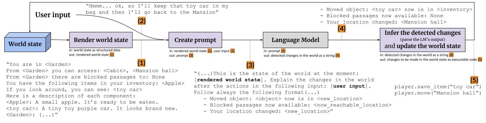

# PAYADOR
This repository contains the code for the PAYADOR approach, described in the ICCC24 paper “PAYADOR: A Minimalist Approach to Grounding Language Models on Structured Data for Interactive Storytelling and Role-playing Games”.

TL;DR: The PAYADOR approach to the world-update problem in Interactive Storytelling (and Role-playing Games) consists of grounding Large Language Models to structured data and use them to predict the outcomes of the player input.

Authors: [Santiago Góngora](https://scholar.google.com/citations?user=p1lKpmYAAAAJ), [Luis Chiruzzo](https://scholar.google.com/citations?user=C7c4uCsAAAAJ), [Gonzalo Méndez](https://scholar.google.com/citations?user=lC8QyOwAAAAJ) and [Pablo Gervás](https://scholar.google.com/citations?user=AcY-Y2gAAAAJ).


## 🗂️ Project structure
The PAYADOR approach is intended to be easily adaptable for other research problems in Interactive Storytelling. Here we will briefly describe each module and add comments about how they should be modified for other cases.

- `main.py` implements the main loop of PAYADOR, as detailed in the picture below (same as Figure 3 of the paper). 
- `world.py` implements the three components of the world model (Items, Characters and Locations) as well as the world itself. This module also implements the world state rendering in natural language and the update of the world state, key steps for the PAYADOR approach.
    - ❗ If you are working for a different language than English, you will need to adapt the *render_world* and *parse_updates* methods.
    - ❗ If you are working for other changes in the fictional world (e.g. mood during a conversation, like in the [Emolift paper](https://computationalcreativity.net/iccc2019/papers/iccc19-paper-44.pdf)) you will need to add another updates in the *parse_updates* method.
- `example_worlds.py` includes some simple ready-to-play worlds. All their world components are in English.
- `models.py` loads and prompts the Gemini model.
    - ❗ If you want to use a different model, you can add another class for it.
- `prompts.py`
    - ❗ If you are working for a different language than English, you will need to adapt these prompts.
    - ❗ If you are working for other changes in the fictional world, you will need to ask for additional updates in the *prompt_world_update* function.


## ⚙️ Usage

Please, follow these steps to get this code running.

### Dependencies

To install the dependencies using [conda](https://conda.io/projects/conda/en/latest/user-guide/install/index.html), just run

```shell
conda env create -f environment.yml
```

and then activate the environment


```shell
conda activate payador
```

### Gemini API key

The default implementation uses the Gemini API as the main Large Language Model, so make sure you put [your API key](https://ai.google.dev/) in a file called `API_key`.

...or you can use any other model by modifying `models.py`! 

### Run!

Finally, just run `main.py`.

```shell
python main.py
```

## 📄 Paper

Preprint: [Research gate preprint](https://www.researchgate.net/publication/381469918_PAYADOR_A_Minimalist_Approach_to_Grounding_Language_Models_on_Structured_Data_for_Interactive_Storytelling_and_Role-playing_Games)

### Citation

If you use some part of this work in your research, please cite:

```
@inproceedings{gongora2024payador,
  title={PAYADOR: A Minimalist Approach to Grounding Language Models on Structured Data for Interactive Storytelling and Role-playing Games},
  author={G{\'o}ngora, Santiago and Chiruzzo, Luis and M{\'e}ndez, Gonzalo and Gerv{\'a}s, Pablo},
  booktitle={Proceedings of The 15th International Conference on Computational Creativity},
  year={2024}
}
```
